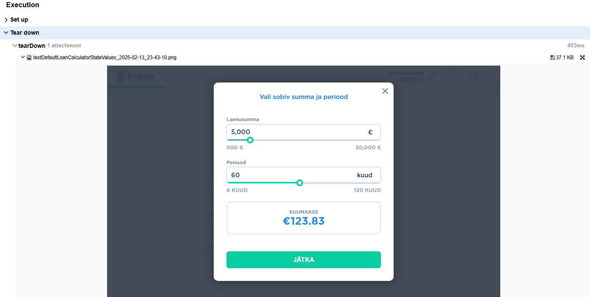

# BB Automation Framework 

This repository contains the **BB Automation Framework** for automating **API and UI tests** using **TestNG, RestAssured, and Selenium**. The framework integrates with **Allure** to generate test reports.

---


Before you begin, make sure you have the following tools installed on your machine:

- **JDK 17 or higher** (Java Development Kit)
- **Maven 3.6+** (for dependency management and project build)

You can verify if you have these installed by running the following commands in your terminal:

```sh
java -version
mvn -v
```
## **Install**

Make sure all dependencies are installed and the project is ready to run by executing the following command:

```sh
mvn clean install
```

This command will download the necessary dependencies and compile the project.

## **Running Tests**

To run tests using Maven, execute the following command:
```sh
mvn test
```
This will run all tests in the `src/test/java` directory using TestNG and RestAssured, and generate the allure-results in the `/allure-results` directory.

Set the HEADLESS option to `true` or `false` in the `config.properties` file.
## **Generate Allure Report**

After running the tests, you can generate an Allure report to visualize your test results. The framework generates the allure-results folder in the target directory by default.

To serve and view the Allure report, run the following command:
```sh
mvn allure:serve -Dallure.results.directory=../allure-results
```
This will start a local server and open the Allure report in your default web browser. The report will include detailed information about your tests, including passed, failed, and skipped tests, along with logs, screenshots, and other useful information.



## **Cleaning the Project**

To clean the project (delete the `target/` & `allure-reports` directories and all generated files), run:
```sh
mvn clean
```
This will remove the target directory, including allure-results, build outputs, and other generated files.

## **Directory Structure**

Here is a brief overview of the directory structure:

```diff
bb-automation-framework/
├── src/
│   ├── main/
│   │   └── java/        # Main source code (e.g., API clients, base test classes)
│   └── test/
│       └── java/        # Test code (e2e, api tests)
├── pom.xml              # Maven Project Object Model (dependencies, plugins)
├── config.properties    # Custom properties
└── README.md            # This readme file
```
####© 2025 Artūras Sutkus [LinkedIn](https://www.linkedin.com/in/artūras-sutkus-22570379/)